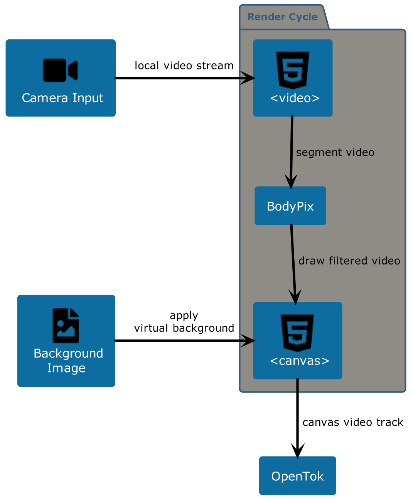

## Introduction

[In a previous blog post](https://webrtc.ventures/2020/01/ai-in-webrtc-background-removal-with-tensorflow-in-an-agora-video-chat-2/)
, we looked at how we could do background removal with Tensorflow in an Agora Video Chat. We saw how semantic 
segmentation can be used to detect background pixels in a video stream. This time, we'll take a look at integrating
background removal with the Vonage Video API, as well as some optimizations that we found that improved performance and
usability.

## Initial Approach

As we saw last time, we can use the [BodyPix model](https://github.com/tensorflow/tfjs-models/tree/master/body-pix) to 
detect background pixels from a video stream, and then use HTML canvas to paint a filtered out image with our replaced
background.

Let's look at a high level overview of our integration.


On each render cycle, a snapshot of what is currently in the `<video>` tag is taken, and then given to the bodyPix
segmentation API. The background image is drawn onto the output `<canvas>`. Then the background pixels from the
segmentation are filtered out and drawn onto the `<canvas>`.

At this point, the `<canvas>` now has the desired image of the user's body and a custom background. A video stream is 
then taken from the `<canvas>` and provided to the OpenTok publisher as the user's video stream.

This simple design makes it really clear how we are doing our rendering. Changing the rendering logic is pretty easy
from this point of view - we just have to change what we are drawing onto the canvas.

Here's how we can do that with some code:

```typescript
private async startCanvasRendering() {
    const canvasContext = this.outputCanvas.getContext('2d')
    if (!canvasContext) {
      throw new Error('Could not get canvas context to start canvas rendering')
    }
    const net = await bodyPix.load({
      architecture: 'ResNet50',
      outputStride: 16,
      quantBytes: 4
    })
    const canvasClone = (canvasContext.canvas.cloneNode(false) as HTMLCanvasElement).getContext('2d')
    if (!canvasClone) {
      throw new Error('Unable to clone canvas context')
    }
    
    this.renderCanvas(canvasContext, canvasClone, net)
}

private async renderCanvas(context: CanvasRenderingContext2D, cloneContext: CanvasRenderingContext2D, net: BodyPix) {
    // Segment input video to identify background pixels vs body pixels
    const segmentation = await net.segmentPerson(this.localVideo, {
      flipHorizontal: true,
      internalResolution: 'high',
      segmentationThreshold: 0.4
    })
    
    // Draw the video to a canvas and use segmentation to remove background
    cloneContext.drawImage(this.localVideo, 0, 0, this.videoWidth, this.videoHeight)
    const imgData = cloneContext.getImageData(0, 0, this.videoWidth, this.videoHeight)
    const pixels = imgData.data
    for (let i = 0; i < pixels.length; i += 4) {
      if (segmentation.data[i / 4] === 0) {
        pixels[i + 3] = 0
      }
    }
    cloneContext.putImageData(imgData, 0, 0)
    context.drawImage(this.backgroundImage, 0, 0, this.videoWidth, this.videoHeight)
    context.drawImage(cloneContext.canvas, 0, 0, this.videoWidth, this.videoHeight)
    
    window.requestAnimationFrame(this.renderCanvas.bind(this, context))
}
```

The key here is to use the segmented output from the bodyPix API and make the pixels identified as the background 
transparent. That way, when the filtered stream is drawn onto the output canvas, the background will be the custom image.

While the canvas is now being rendered with a virtual background, we can capture a video stream from the canvas and provide that to the vonage API:

```typescript
get canvasVideoTrack() {
  return this.outputCanvas.captureStream().getVideoTracks()[0]
}

initPublisher() {
  this.publisher = OT.initPublisher(this.publisherWrapper, {
    insertMode: 'append',
    width: '100%',
    height: '100%',
    videoSource: this.canvasVideoTrack
  })
  this.session.publish(this.publisher)

}
```

## Analysis

This process is quite resource intensive. Lower end devices may struggle to keep up with the processing. We can tune a few different areas to make a tradeoff between
accuracy of the background removal versus the resource utilization.

Reducing the video dimensions and frame rate can have a high impact on resource utilization. Lower end devices may be able to keep up with a resolution of
240p, while higher end devices might be able to run with a more desirable resolution of 480p.

The BodyPix library also contains a few different models with different parameters that can be tuned to find a desirable balance. For instance, we could get
some high accuracy with high resource utilization with the following model:
```typescript
const net = await bodyPix.load({
  architecture: 'ResNet50',
  outputStride: 16,
  quantBytes: 4
})
```

For lower end devices we can have lower accuracy background removal with the following:
```typescript
const net = await bodyPix.load({
  architecture: 'MobileNetV1',
  outputStride: 16,
  multiplier: 0.5,
  quantBytes: 1
})
```

Apart from tuning, we found one issue with our initial approach. As we can see from the code snippets above, we are recursively invoking `renderCanvas`
in a callback from `window.requestAnimationFrame`.  The issue was found when a user was publishing their video form one chrome tab, but was also sharing another
chrome tab to the video session. While the user had a separate tab active, their camera video (with background removal) was stuck, and then went away.

Looking at some documentation for [window.requestAnimationFrame](https://developer.mozilla.org/en-US/docs/Web/API/window/requestAnimationFrame):

> `requestAnimationFrame()` calls are paused in most browsers when running in background tabs or hidden

This API initially sounds like the best tool for the job. However, this caveat makes itnot so well suited to our use 
case. Video calling today has expanded way beyond just being a conversation involving a simple video stream. Many users
today want to have presentations where they are sharing content. Having our application always being in the foreground 
is not an option.

One might think to try using something like `window.setTimeout` instead, but we have found similiar issues with this as well.
[Turns out, this has been an issue for some time.](https://stackoverflow.com/questions/5927284/how-can-i-make-setinterval-also-work-when-a-tab-is-inactive-in-chrome/5927432#12522580)

## Web Workers

Web workers are a way to run javascript in background threads. These background threads do not get throttled the same way
as with things like `setTimeout` or `requestAnimationFrame`.

With this, we can move our canvas rendering into a background thread and resolve our issue.
(Worker Timers)[https://www.npmjs.com/package/worker-timers] is a library that provides setInterval() and setTimeout() APIs
that will run the callbacks in on a web worker. This fits in really nicely with our existing code:

```typescript
import * as workerTimers from 'worker-timers'

...

private async renderCanvas(context: CanvasRenderingContext2D, cloneContext: CanvasRenderingContext2D, net: BodyPix) {
  // Segment input video to identify background pixels vs body pixels
  const segmentation = await net.segmentPerson(this.localVideo, {
    flipHorizontal: true,
    internalResolution: 'high',
    segmentationThreshold: 0.4
  })

  // Draw the video to a canvas and use segmentation to remove background
  ...

  workerTimers.setTimeout(this.renderCanvas.bind(this, context, cloneContext, net), 30)
}
```

## Results

The Worker Timers library basically provided us with a drop in replacement to our initial approach. The library
also was able to successfully render our canvas publisher in a background tab and not have the rendering process 
throttled by the browser.

Higher end devices may be able to run this smoothly. Testing this on an i7 2019 Macbook Pro with 32GB of RAM ran ok 
for higher quality video with high accuracy settings on the BodyPix model. However this may not be as good for medium
to lower end devices many users have today. Lower requirement configurations may be required along with some way to 
detect the specs of the user's harware, and choose and set the model appropriately.

You can see the full POC code [here](https://github.com/justinIs/nuxt-background-removal)

## Ready to build something new?
At WebRTC.ventures, we can build customizable video applications with features such as recordings, transcriptions, 
image processing, and more. We have an experienced team ready and happy to help you out.
[Contact us today!](https://webrtc.ventures/contact/)
